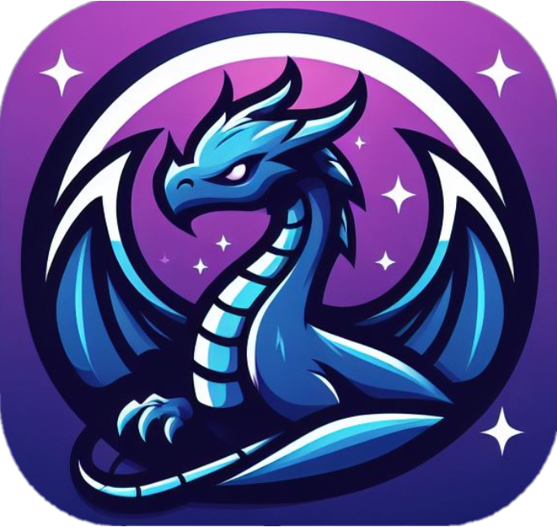

<div align="center">
 
</div>

# Falkor: Your Ultimate Gaming Hub

Dive into Falkor, where you'll discover a vast selection of games coupled with community-driven enhancements. Experience seamless and secure gaming within a single, universal hub.

Built with the cutting-edge technology of Electron and React, Falkor offers an unparalleled gaming experience that's fast, secure, and cross-platform.

## Features

As the project continues to evolve, we have an exciting lineup of features in development, including:

- Comprehensive tools to help you organize and manage your game collection effortlessly (W.I.P).
- An integrated torrent client for seamless game downloads (W.I.P).
- A release calendar to keep you updated on upcoming game launches.
- A powerful API that allows the community to create third-party plugins (currently limited to providers, but with plans to expand soon).
- And much more on the horizon...

Stay tuned—there’s plenty more to come!

## Getting Started

To get started with Falkor, follow these steps:

1. Ensure that you have Yarn installed on your system. You can find installation instructions [here](https://classic.yarnpkg.com/en/docs/install).

2. Navigate to the main directory and execute `yarn install`. This command will install all dependencies required for the project.

3. Set up the necessary environment variables by duplicating the file `.env.example` and renaming it to `.env`. Then, fill in the required information.

4. Run `yarn dev` to kick off the development server and watch your changes in real-time.

### IGDB (Twitch)

- `VITE_TWITCH_CLIENT_ID`: Twitch client ID (https://api-docs.igdb.com/#getting-started)
- `VITE_TWITCH_CLIENT_SECRET`: Twitch client secret (https://api-docs.igdb.com/#getting-started)

### ITAD (IsThereAnyDeal)

- `VITE_ITAD_API_KEY`: ITAD API key (https://docs.isthereanydeal.com/#section/Access)

### RD (Real Debrid)

- `VITE_RD_CLIENT_ID`: Open source app RD client ID found in the Real Debrid documentation (https://api.real-debrid.com/)

### NixOS Flakes

```nix
# flake.nix

{
  inputs.falkor.url = "github:Team-Falkor/app";
  # ...

  outputs = {nixpkgs, falkor, ...} @ inputs: {
    nixosConfigurations.HOSTNAME = nixpkgs.lib.nixosSystem {
      specialArgs = { inherit inputs; }; # this is the important part
      modules = [
        ./configuration.nix
      ];
    };
  }
}

# configuration.nix

{inputs, pkgs, ...}: {
  environment.systemPackages = with pkgs; [
    inputs.falkor.packages.${pkgs.system}.default
    # ...
  ];
}
```

## Contributing

We welcome contributions to Falkor! If you are looking for ways to contribute, here are some options:

- Assisting in writing and enhancing the documentation.
- Contributing code that you believe could enhance the project.
- Aiding in bug testing on pre-releases.
- Adding i18n translations for multiple languages.

If you're unable to assist with any of these, no worries! We simply appreciate your presence and support on this journey! 😄

## i18n Translations

We welcome you to contribute translations to Falkor! Here are some steps to help you get started with translating the app 😀

1. Navigate to the `src/i18n/translations` folder and duplicate the `english.json` file.
2. Translate all the values, ensuring that you keep the keys the same.
3. Go back to the `src/i18n` folder and open `index.tsx`. Import your new translation JSON file and add it to the `resources` object.

That's it! Thank you for helping make Falkor accessible to more users.

## Acknowledgments

- Built with [Electron](https://www.electronjs.org) and [React](https://react.dev/).

- All game data comes from the following APIs: [IGDB](https://www.igdb.com/), [ITAD](https://isthereanydeal.com/), and [Steam](https://store.steampowered.com/). We are not affiliated with any of these services; we simply utilize their APIs for data.

Thanks to everyone who helps us make this possible. A list of contributors can be found [here](https://github.com/team-Falkor/app/graphs/contributors).

<br />

# ❤️

Reminder that <strong><i>you are great, you are enough, and your presence is valued.</i></strong> If you are struggling with your mental health, please reach out to someone you love and consult a professional. You are not alone; there is a large range of resources online for support and guidance.
